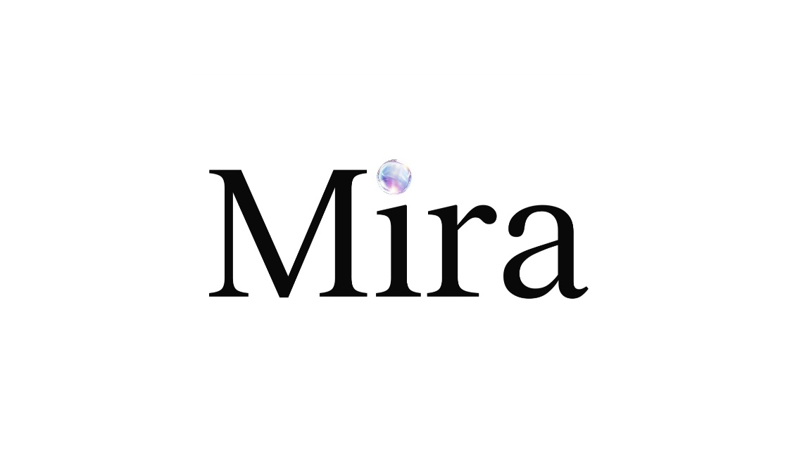

# mira


Mira is a real-time facial recognition based conversational intelligence engine.

Devpost: [https://devpost.com/software/mira-72v46f](https://devpost.com/software/mira-72v46f)

## Features
- OpenCV based real-time face recognition and state tracking
- Context storage via LMDB
- Audio analysis pipeline (Whisper/Lemonfox)
- Flask API exposing the current state  
- Frontend liquid-glass UI overlay  

## Tech Stack

**Backend:** Python, Flask, OpenCV, LMDB, FFmpeg/MediaMTX

**Frontend:** HTML/CSS/JavaScript, [liquid-glass](https://github.com/shuding/liquid-glass)

**Hardware:** For demo: Macbook Air Webcam, Hardware mockup: Raspberry Pi Zero 2 W + CSI camera

## Usage
Download dependencies
```bash
pip install -r requirements.txt
```
```bash
brew install mediamtx
```

Start mediamtx server 
```bash
mediamtx
```

Stream rtsp av stream to mediamtx using ffmpeg/OBS Studio/other

Run main
```bash
python main.py
```

Run facial recognition worker
```bash
python face.py
```

Navigate to `frontend/main.html`